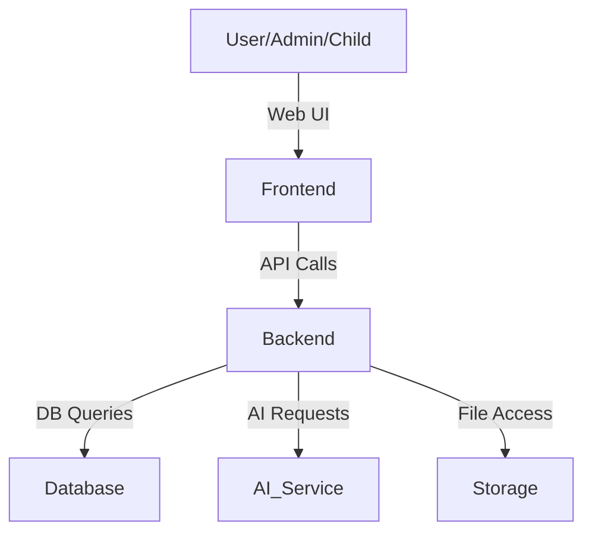

# AI Counseling Web App – Architecture & System Design

## Overview
The AI Counseling Web App is a modular, full-stack application designed to facilitate AI-driven counseling, resource management, and analytics. It leverages modern web technologies for scalability, maintainability, and a seamless user experience.

---

## 1. High-Level Architecture

---

## 2. Frontend
- **Framework:** Next.js (App Router)
- **UI:** React components, Tailwind CSS
- **Features:**
  - Dynamic routing for dashboards, admin, children, sessions, etc.
  - Modular components for chat, analytics, session management, and admin tools
  - Authentication and protected routes

---

## 3. Backend (API Layer)
- **Framework:** Next.js API routes
- **Responsibilities:**
  - Handles business logic for admin, children, sessions, AI chat, analytics, etc.
  - Exposes RESTful endpoints for frontend consumption
  - Integrates with AI services for chat/mentoring
  - Manages authentication (NextAuth)

---

## 4. Database
- **ORM:** Prisma
- **Schema:** Defined in `prisma/schema.prisma`
- **Entities:** Users, Children, Sessions, Assignments, Knowledge Base Resources, Stories, etc.
- **Usage:**
  - Stores user profiles, session data, resources, analytics, and more

---

## 5. AI Integration
- **AI Service:**
  - API endpoints under `/api/ai/` handle chat and roadmap generation
  - Likely connects to an external LLM (e.g., OpenAI, custom model)
  - Provides context-aware responses and session summaries

---

## 6. Authentication & Authorization
- **Library:** NextAuth.js
- **Features:**
  - User signup/login
  - Role-based access (admin, child, etc.)
  - Session management

---

## 7. Modular Structure
- **Pages:** Organized by feature (admin, children, dashboard, sessions, knowledge base)
- **Components:** Reusable UI and logic for each feature
- **API:** Feature-specific endpoints for clean separation of concerns
- **Lib/Hooks:** Shared utilities and custom hooks

---

## 8. Data Flow Example (AI Chat Session)
1. User navigates to AI Mentor page
2. Frontend sends chat input to `/api/ai/chat/`
3. Backend processes input, fetches context, and calls AI service
4. AI response is returned and displayed in the chat panel
5. Session data is stored in the database for history/analytics

---

## 9. Analytics & Dashboard
- **Data Aggregation:** Backend aggregates session and concern data
- **Visualization:** Frontend displays analytics (trends, maps, stats) using modular components

---

## 10. Extensibility
- **Easily add new features:** Modular API and component structure
- **Scalable:** Can integrate more AI services, analytics, or user roles as needed

---

## 11. Security & Best Practices
- **Authentication:** Secure user/session management
- **API Validation:** Input validation and error handling
- **Role-based Access:** Admin/user separation
- **Environment Variables:** Sensitive data managed securely

---

## 12. Deployment
- **Static Assets:** Served from `public/`
- **Server:** Can be deployed on Vercel, AWS, or any Node.js-compatible platform
- **Database:** Cloud or managed PostgreSQL/MySQL (via Prisma)

---

For more details on any specific module or flow, refer to the corresponding folder or file in the codebase. 